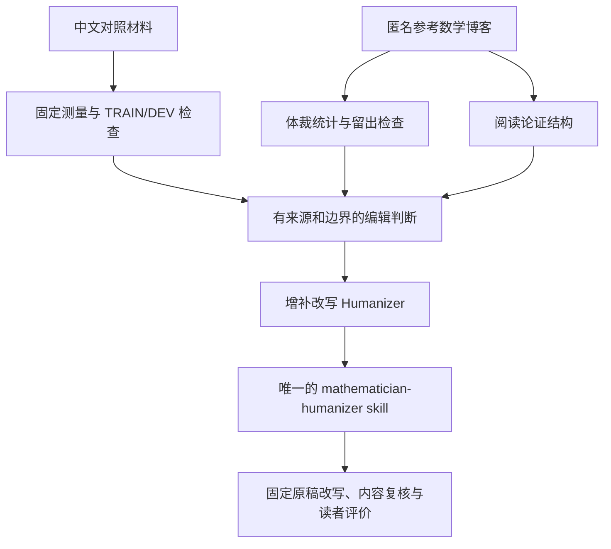

# 研究路线与结果

本项目的研究目标是把已有统计分析转化为可执行的编辑判断，再用 one of the mathematicians 的博客论证习惯重写 Humanizer，交付一个风格贯穿全文的 skill。统计负责发现和约束编辑问题，博客阅读负责解释如何组织论证，实际改稿负责检验这些规则是否有用。

当前已经完成历史快照的描述性分析、规则整理和一个完整改稿演示。独立的读者评价与跨主题效果验证仍未完成。本报告说明每一步用了什么材料、得出了什么、怎样进入 skill，以及哪些材料退出当前发布目录。

## 1. 先明确要回答的问题

Humanizer 提供了清理模板化表达的经验规则，但仅靠删除热词、排比和空泛强调，不能保证一篇文章的论证容易跟随。我们还需要回答三个问题：

1. 中文对照材料中，哪些表达差异能在不同划分和来源下保持，哪些只是来源或题材的差异？
2. 参考数学博客如何提出问题、解释选择、展开关键步骤并交代范围？这些习惯怎样贯穿不同体裁？
3. 把两者写成一个 skill 后，同一原稿是否更容易理解，同时保持事实和数学内容？

第一项是统计观察，第二项包含人工阅读与组织分析，第三项需要实际改稿评价。三者的证据不能相互替代。当前交付不包含作者识别、真人概率或写作质量分，也不把复杂模型、隐表示、动力学和拓扑作为改写的前置条件。



## 2. 中文统计：先测量，再检查能否推广

材料来自已有 M4 中文导出，使用其 HUMAN/CHATGPT 标签，按 Baike 与 Web 来源分开。标签没有经过独立的无辅助作者身份验证。现有 TRAIN 和 DEV 都已被检查；这份规则属于开发侧适配，中文 TEST 没有进入规则编译。

测量分两部分：

- **表层结构：** 八项字级、操作句与物理行指标。内容字符为 Unicode L/N 类别，标点形成操作句，含内容的物理行形成操作段。历史表层分析用既有缓存的充分统计重放固定公式，本次没有重新读取原语料。物理行不等于修辞段落。
- **词汇与句法：** 固定本地 Stanza 仪器可记录 71 项词性、依存与词汇观测；当前结果只保留十项定义明确的中文参考。它们共享分母和相关结构，不能视为 71 个独立风格维度，依存图也不是论证图。

版本和衍生文档按已声明分量控制权重。文档先在分量内合并，分量再等权；配对比较在相同来源与划分内进行，缺失不补零。历史表层 TRAIN 使用 400 次分量重抽样；区间和筛查都是探索性的，没有多重比较校正，不能解释成因果编辑收益。当前 `summarize` 命令沿用这些汇总原则，不自动发现漏标的重复文档。

以句长中位数的可用样本为例，TRAIN 有 1,816 对、1,771 分量，DEV 有 591 对、590 分量；其他指标可用数量不同。十项词汇参考的联合可用 HUMAN 样本另为 Baike 899 文档/868 分量、Web 903/890，不能混用这两个样本量。

### 结果：五项观察可以成为编辑检查问题

下表差值均为 HUMAN − CHATGPT。前三项单位为内容字符，后两项无量纲。完整来源内差值、区间、可用数量与筛查状态见 [results.json](../research/results.json) 的 `chinese_surface`。

| 观察 | TRAIN 差值 | DEV 差值 | TRAIN/DEV 分量 | 编辑时要检查什么 |
|---|---:|---:|---:|---|
| F013 句长中位数 | 10.741 | 5.892 | 1771/590 | 是否把紧密关联的条件拆成了过多短句 |
| F014 句长四分位距 | 2.796 | 3.584 | 1771/590 | 是否把不同信息负担修成了相同句长 |
| F015 句长 90 分位数 | 19.904 | 14.955 | 1771/590 | 承载完整条件的长句是否被不必要地切碎 |
| F024 相邻句长变化/中位数 | 0.300 | 0.329 | 1652/559 | 判断、例子和解释是否机械地占用相同篇幅 |
| F025 相邻句长秩相关 | 0.098 | 0.134 | 1235/404 | 节奏是否跟随实际衔接，是否硬套长短句交替 |

它们通过了现有 TRAIN 工程筛查与 DEV 方向检查。规则因此要求回看具体阅读障碍，而不要求所有文章变长、增加方差或追赶某个均值。这里从“观察差异”到“编辑问题”的转换是人工解释，尚未证明干预效果。

### 失败与不采用的处方

F002 段落密度的来源方向相反：Baike 的 TRAIN/DEV 差值为 +4.769/+8.459，Web 为 −8.307/−8.002。它不能生成统一段落数目标。F002、F003 单句操作段占比、F016 归一离散程度都没有通过现有通用检查门，结果仍保留在最终汇总中。

十项词汇参考保留两个来源的均值、分位数和离散程度，服务于准确术语、自然从句与稳定人称的选择。两份同内容、保留八项虚构事实的历史示例还直接检验过“口语短词会产生更短词元”的设想：

| 实际量测 | Baike 引导版 | Web 引导版 | 结果 |
|---|---:|---:|---|
| 单汉字词元占比 | 0.4857 | 0.4179 | 较口语版反而更低 |
| 平均词元码点长 | 1.5714 | 1.6269 | 较口语版反而更长 |

两版共十个操作单元成功解析，没有失败；名词、动词、副词方向部分符合来源参考，形容词和依存跨度没有跟随来源均值方向。第一、第二人称与固定否定形式计数均为零，零不表示没有否定含义。两版不足 100 词元，窗口量保持不可得。

全部十项数值、原文指纹与失败说明保留在 `results.json` 的 `editing_counterexample`；原例文和完整回执进入 Git 历史。这个小实验只能说明具体短语不是可靠的数值控制器，不能证明普遍写作改善或读者偏好。

## 3. 参考博客：统计节奏，阅读论证

作者统一以 **one of the mathematicians** 代指，来源别名为 `public-mathematics-blog/1`。历史公开快照覆盖 2007—2026 年，登记 1,234 个记录：1,130 文章、104 页面；1,114 份进入测量，共 2,381,354 个英语词项。客座/其他作者、混合索引与勘误页、过短目录、嵌入页先分流，纳入材料仍可能有合作叙述和引文。

开发侧 1,040 份，另外 74 份按年份/文章留出，包括 2020、2023 年份与静态建议页。文章与重叠家族控制权重；历史分析还按体裁、长度和时期分层。英文仪器排除公式占位等内容，短正文块筛选影响段长，所以测量分母必须跟着结果解释。

### 体裁结果用于决定展开方式

当前交付四类直接用于 skill 的体裁参考，保留每项观测的可用文章数与家族加权 q10、中位数、q90。它们是开发侧的一部分，不是全部 1,040 份的完整分类表。其余体裁、主题、长度和时期的全量分层表可在历史提交中追溯。

| 体裁 | 开发文章/家族 | 句均词数中位数 | 段均词数中位数 |
|---|---:|---:|---:|
| 数学说明 | 311/309 | 19.517 | 44.500 |
| 课程讲义 | 146/146 | 16.997 | 38.304 |
| 学习/职业建议 | 29/29 | 33.083 | 70.200 |
| 写作建议 | 16/16 | 32.333 | 58.400 |

这说明参考材料本身也随体裁改变节奏。skill 保持共同的解释习惯，允许讲义系统展开证明、说明围绕一个机制、札记留下具体疑问。它不把每篇文章写成同样的开头和段落，也不把英文句长和词性阈值搬到中文。

### 论证习惯来自阅读，不能由句法量冒充识别

我们从以下阅读篇目归纳组织习惯，并把它们写成六项正向规则：

| 阅读依据 | 提炼的组织习惯 |
|---|---|
| Crossing number inequality | 从可检查的弱结论逐步加强，在关键选择前说明动机 |
| Dyadic models | 解释简化模型保留了什么结构、丢失了什么 |
| Compactness in topological spaces | 让对象、定义、证明目标与步骤相互承接 |
| Learn and relearn your field | 围绕已有结论重新提出具体问题 |
| Give appropriate amounts of detail | 按读者知识与决定性步骤分配解释篇幅 |

固定底色是明确对象与问题、有动机的选择、必要时逐步加强、充分展开关键机制、稳定术语与条件、回到原问题交代所得。这是编辑阅读总结；统计为体裁与节奏提供描述性参考，没有自动识别数学论证，也没有证明这些习惯是该作者独有的。

### 留出检查的实际结果

74 份留出材料接受过冻结规则的描述性边际覆盖检查。当前保留全部六项计数：句长 55/74，段长 48/74，名词占比 54/74，动词占比 52/74，依存跨度 55/74，MATTR100 为 57/72；后者有两份不可用。结果并非全部落入区间。

这些计数检验参考区间在留出材料上的覆盖情况，没有检验改稿质量、作者相似度或联合分布匹配。没有全语料人工金标、对照作者实验或参考作者亲笔中文语料。当前整理只选取冻结结果，没有重新解析博客。

## 4. 把结论增补进 Humanizer

采用 [Humanizer 3.1.0 的固定提交](https://github.com/blader/humanizer/tree/225a6f39ac85f76ee48dbad772ea4abe4ed6c9d8) 的单一技能入口、规则示例、复核流程和 26 项清理规则。它的上游效果声明不作为本项目的验证证据。

研究进入技能的方式如下：

| 依据 | 写进技能的判断 | 必须保留的边界 |
|---|---|---|
| 中文 TRAIN/DEV 句长与衔接差异 | 按信息负担合并或拆句，检查机械节奏 | 不追数值，不随机安排长短句 |
| 来源差异与词元方向失败 | 保留准确术语，把无效名词堆叠还原为行动和从句 | 不统一规定段落数，不承诺短语能控制解析指标 |
| 博客阅读与体裁统计 | 以六项论证习惯重组全文，按体裁展开 | 组织习惯是人工解释，英语阈值不迁移到中文 |
| Humanizer 的 26 项规则 | 清理空泛强调、虚饰、机械版式和聊天残留 | 真实对比、条件、动机与教学回顾不删除 |
| 数学和事实内容保护 | 原稿与新稿逐项对照条件、量词、公式和结论 | 自动检查不能认证语义或证明 |

根目录 [SKILL.md](../SKILL.md) 是唯一技能正文，包含完整工作流、六项论证习惯、26 项规则的原创前后例子与交付要求。两张生成风格卡保留统计范围，普通改稿直接使用已总结的规则，不必每次重跑研究。

`compile` 只核对最终结果指纹并生成两张风格卡。数字到编辑问题的解释在 `profiles.py` 中维护；技能正文中的论证规则与例子人工维护。Python 分析器不生成新文章。

## 5. 用实际改稿检验，而不是用指标宣布成功

当前公开一个完整的[最小二乘改写对比](../examples/rewrite.md)：原稿、终稿和受保护内容检查都保留。终稿展开了投影为什么保证拟合向量唯一，以及核为什么决定系数自由度；公式序列保持。限定表达的词面变化仍需人工内容复核。

这个演示由语言模型编写并自查，没有独立数学审阅或盲评。历史的四份单篇原创说明及其量测回执退出当前示例目录，因为它们没有构成同稿前后比较，不能用来宣布改写有效。它们仍在已提交的历史版本中。

下一步的效果研究应固定不同主题的原稿和规则版本，再比较原稿与改稿：事实和数学内容是否保持、关键步骤是否更容易跟随、整篇风格是否稳定。内容错误、失真、未改善的例子同样登记。独立内容审核与读者评价分别记录；规则调整后不能把已看过的案例重新称为留出验证。

| 阶段 | 当前状态 | 可以宣称什么 |
|---|---|---|
| 历史中文与博客描述性统计 | 已有冻结结果 | 特定材料、仪器和划分下的观察 |
| 统计与阅读到编辑规则的转换 | 已完成候选规则 | 可执行且有来源说明的编辑判断 |
| 技能和内容保护工具 | 已实现并有工程检查 | 文件、计算与保护检查按约定运行 |
| 完整同稿改写 | 一个原创演示 | 可以检查具体改动及其自查 |
| 独立内容审核、读者偏好与跨主题效果 | 未完成 | 尚不能宣称改写效果已验证 |

[验收条件](ACCEPTANCE.zh.md)以实际成品和用户判断为准。用户私人博客不属于当前路线。

## 6. 当前仓库只保留交付所需材料

`research/` 只保留四个文件：

| 文件 | 用途 |
|---|---|
| [results.json](../research/results.json) | 八项中文表层结果、十项词汇参考、四类博客体裁、留出计数与词元方向失败 |
| [manifest.json](../research/manifest.json) | 当前文件指纹、来源提交、提取范围及匿名化前后的来源绑定 |
| [chinese-parser.json](../research/chinese-parser.json) | 实际中文解析器、模型、资源与权利来源合同 |
| [english-contract.json](../research/english-contract.json) | 实际英文仪器、权重、分母与历史身份合同 |

历史全量分层导出、条件带与协方差、下载预算、旧运行时清单、旧例文及逐篇量测/审计回执保存在提交 [9a98044](https://github.com/proffitteoy/style-compiler/tree/9a98044663d664cc6d9e4dd7d93f2b79a9a812a9)。清单记录实际使用来源的路径与 SHA；当前结果是这些文件的字段选取，保留值未重算。更早的来源和匿名化转换也保留在清单中。

例如查看历史全量开发表：

```sh
git show 9a98044663d664cc6d9e4dd7d93f2b79a9a812a9:research/mathematician/development-profiles.json
```

构建回执默认打印到 stdout，需要留存时用 `compile -o artifacts/style-cards-build.json`。量测、解析缓存、构建目录、权重和原语料不进入版本控制。`examples/` 只保留当前完整改写对比及其复核说明。

从仓库根目录可以核对交付：

```powershell
$env:PYTHONPATH = "src"
python -m style_compiler compile
python -m style_compiler check examples/rewrite.original.txt examples/rewrite.final.txt
python -m unittest discover -s tests -v
```

这些命令核对最终输入、生成卡和内容保护行为。历史原语料未分发，历史解析环境也不会隐式下载，因此它们不是全语料重测命令。测量协议和可选本地解析见[架构与协议](architecture.md)。
